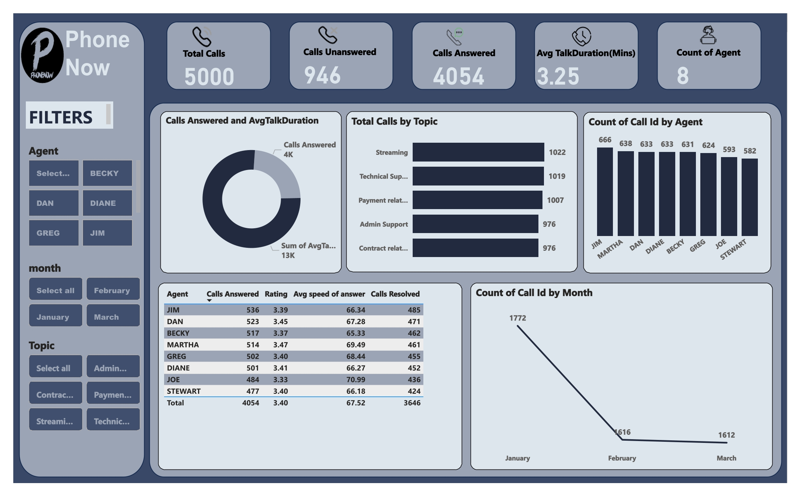

# Pwc-Call-Center-Analysis-
A Report on my virtual internship with PWC, a big telecom  company and this is their call center data analysis to derive insights. 
# PWC-Call-Center-Analysis

Report on my virtual internship with PWC, a big telecom company and this is their call center data analysis to derive insights. 
## INTRODUCTION
Forage is a site that offers virtual internship to beginners in any filed to enable them get hands on experience of what its like to work in the real world, I registered for the Power Bi internship with PWC ,
My first task was to Analyze the call center data of a big Telecom company called PHONENOW who is looking for transparency and insight into there data, to know the customer and agents behavior and to that effect the call center manager needed a dashboard with the relevant KPI's to enable her communicate with the management .

## PROBLEM STATEMENT
**PROBLEM STATEMENT**
The call center manager needs the analysis in order to understand customer behavior and what they are calling for and to to also understand how well the agents are handling the calls and whether the issues being called about is being resolved as this would go a long way improving the company's services and customer satisfaction is paramount to any business, with all these in mind the following questions was answered,
- Total agents and Total num of calls
- Total number of calls answered and total calls abandoned
- Speed of answer(avg speed of answered and avg speed of answer among agents)
- Which topic is most called about .
- Average Length of calls
- Total number of calls received monthly
- Agent's performance quadrant ->
average handle time (talk duration)
calls answered
Overall customer satisfaction
Total calls resolved
Best performing agents(agents with the highest answered and resolved calls) .

After defining the questions I wanted answered , I went on to data inspection.

### TOOLS 
- power bi
- Power Query

### SKILLS SHOWN
- Dashboard building
- Slicers
- KPI'S

### STEPS TAKEN 
i took the following steps to get the data ready for visualization 
- Data loading
- Data cleaning i cleaned the data in power query(PQ) by :
1. i replaced the columns with the Y AND N WITH YES OR NO With the replace values option in PQ, 
2. fixed the column data types
3. Extracted minutes from a column containing secs
4. Extracted time from a date/time column 
5. Extracted month from the date column.
- Trimmed the texts
- Went on to create the needed measures for the analysis

## INSIGHTS

- A TOTAL OF 5000 CALLS WAS RECEIVED AND ONLY 946 WAS UNANSWERED WHILE 4054 WAS ANSWERED 
- AVERAGE TALK DURATION IS 3.25 MINUTES
- PHONENOW HAS A TOTAL OF 8 AGENTS
- JIM BEING THE AGENT WITH THE HIGHEST ANSWERED CALLS OF 536 WITH 485 BEING RESOLVED, AVAERAGE SATISFACTION RATE OF 3.39 AND AVERAGE SPEED OF ANSWER OF 66.34 
 FOLLOWED BY DAN WITH THE HIGHEST ANSWERED CALLS OF 523 WITH 471 BEING RESOLVED, AVAERAGE SATISFACTION RATE OF 3.45 AND AVERAGE SPEED OF ANSWER OF 67.28.
- TOPIC : STREAMING WAS THE MOST TALKED ABOUT WITH 1022 CALLS FOLLOWED BY TECHNICAL SUPPORT WITH 1019 CALLS AND PAYMENT RELATED WITH 1007 CALLS
- DATA WAS FOR JANUARY, FEB , MARCH AND JAN HAS THE HIGEST CALLS OF 1772 WITH FEB AND MARCH HAVING 1616 ND 1612 RESPECTIVELY.

## VISULIZATION

## RECOMMENDATION

1. Call Handling Efficiency: Out of a total of 5000 calls, only 946 were left unanswered. this number is not soo bad but can be improved ,To maintain this efficiency, the reasons for unanswered calls should be found and strategies implemented to reduce further them.

2. Agent Performance Spotlight : Jim and Dan , the top agents. Jim answered 536 calls with a satisfaction rate of 3.39, while Dan followed closely with 523 calls and a satisfaction rate of 3.45. Recognize and reward high performers, and consider knowledge sharing sessions to elevate the entire team. and also ensuring the workload is evenly distributed and no one has to carry a bigger work to ensure and maintain efficiency.
3. Striking a Balance with Talk Duration: The average talk duration stands at 3.25 minutes. this should be investigated to ensure that the conversations align with customer expectations and does not deviate from that.
4. Navigating Hot Topics : Streaming, technical support, and payment-related issues were the top three discussed topics with 1022, 1019, and 1007 calls, respectively. Invest in targeted agent training to increase expertise and resolution rates in these areas. also consider creating a much more detailed guide's on those topics and adding it to the help page to reduce the number of calls/enquires on them
5. Monthly Call spike : January saw the highest call volume with 1772 calls, compared to February and March with 1616 and 1612 calls, respectively. Analyze and pinpoint the reasons behind this spike and use the discovered insights to proactively manage future peak periods.
6. Customer Satisfaction : Keeping a close watch on customer satisfaction metrics, especially for resolved calls. Identify areas for improvement through agent training or process enhancements to elevate satisfaction rates.
8. Establishing Continuous Monitoring : Implement a regular monitoring system to track ongoing performance metrics. This is to enable swift responses to emerging trends or issues, providing a proactive approach to the call center management.

Article link : [Medium](https://link.medium.com/uJYmgpJL8Fb)

And that's all, THANK YOU FOR READING. 🙂

